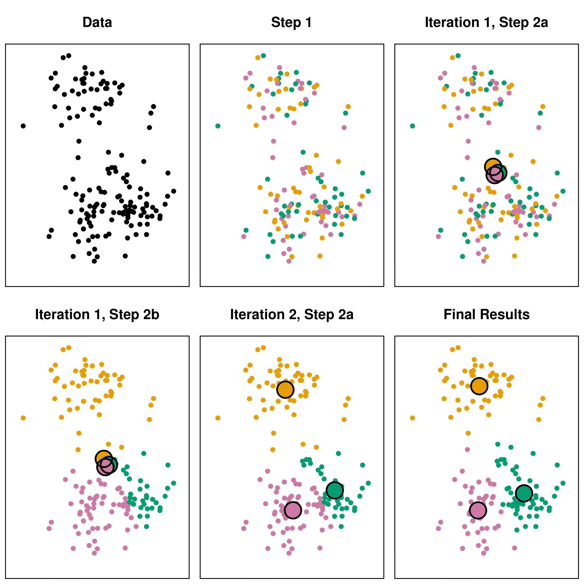

# Image Segmentation

Image segmentation is the process of matching images with similar features together. It's useful for object recognition, tracking, and image compression.

# Image Segmentation by Clustering

Clustering is the process of grouping similar objects together. We can use clustering to segment images by grouping similar pixels together.

# K-Means Clustering

K-means clustering is the idea of taking each point as a 3D vector of color.

1. **Initialization**: Choose k points as the initial centroids
2. **Assignment**: Assign each point to the nearest centroid.
3. **Update**: Update the centroid to the mean of the points assigned to it.
4. **Repeat**: Repeat steps 2 and 3 until convergence.

How do we choose a good value for k? We can use the elbow method to find the best value for k.

## Initialization

We can initialize the centroids in a few ways:

1. Randomly
2. Randomly select k points from the data
3. K-means++

We will often just use a random guess and pick the best results.

K-means is very sensitive to initialization. It's possible to get different results each time you run the algorithm.Bad initialization may lead to poor convergence speed, poor overall results, etc.
