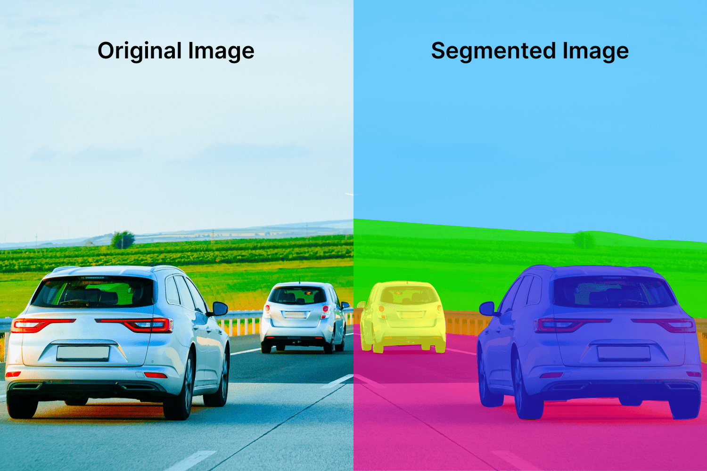

# Image Segmentation

Image segmentation is the process of matching images with similar features together. It's useful for object recognition, tracking, and image compression.

# Image Segmentation by Clustering

Clustering is the process of grouping similar objects together. We can use clustering to segment images by grouping similar pixels together.

# K-Means Clustering

K-means clustering is the idea of taking each point as a 3D vector of color.

1. **Initialization**: Choose k points as the initial centroids
2. **Assignment**: Assign each point to the nearest centroid.
3. **Update**: Update the centroid to the mean of the points assigned to it.
4. **Repeat**: Repeat steps 2 and 3 until convergence.

How do we choose a good value for k? We can use the elbow method to find the best value for k.

## Initialization

We can initialize the centroids in a few ways:

1. Randomly
2. Randomly select k points from the data
3. K-means++

We will often just use a random guess and pick the best results.

K-means is very sensitive to initialization. It's possible to get different results each time you run the algorithm.Bad initialization may lead to poor convergence speed, poor overall results, etc.

# Super Pixel Segmentation

Super pixel segmentation is the idea of grouping similar pixels together to form a super pixel. This is useful for image compression, object recognition, and tracking.

# SLIC

# Template Matching

Template matching is the process of taking a target image and finding the most similar image from iterating over every window of a sample image. This is very similar to covariance tracking. But how do we determine similarity?

# Normalized Cross-Correlation

Normalized cross-correlation is the idea of taking the dot product of two vectors and normalizing it.

$$
NCC(P,T)=\sum_{r,g,b}\frac{1}{n-1}\sum_{x,y}\frac{(P(x,y)-\bar{P})(T(x,y)-\bar{T})}{\sigma_P\sigma_T}
$$

Where:

- $P$ is the patch
- $T$ is the template
- $n$ is the number of pixels
- $\bar{P}$ is the mean of the patch
- $\bar{T}$ is the mean of the template
- $\sigma_P$ is the standard deviation of the patch
- $\sigma_T$ is the standard deviation of the template
