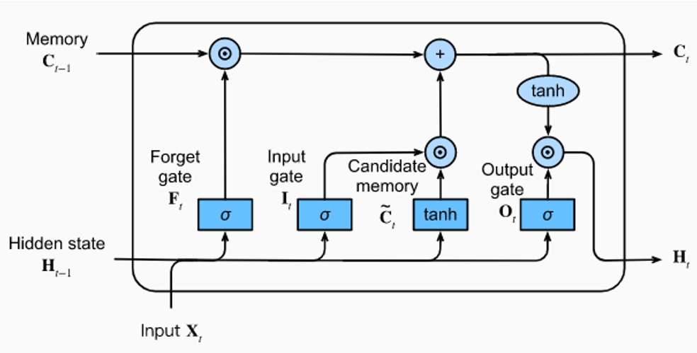

# RNNs

RNNs have an extra type of unit: a recurrent hidden unit. They take output and pass it back to a past layer. This allows the network to have a memory of past inputs. We can think of this as an extra set of weights.

# RHU Error

We use the same error function as before, except we replace our $d$ and $y$ with $d^(t)-y^(t)$, where $t$ is our time t. Then, we sum the whole sequence to get our _sequence error_, and then we can create a _total data error_ by summing our sequence errors.

# Backpropagation Through Time

We can use backpropagation to train our RNNs. We treat the RNN as a DNN, where we add a new dimension T, which is the same shape as one instance of the RNN. Weights are shared between each new dimension layer.

# Gradient Calculations

We have to learn the weight and bias terms for the RNN. We need to calculate the output, hidden-to-hidden, and input weights.

Then, we can update the weights using the gradient descent algorithm.

# BPTT Algorithm

1. Initialize the weights and biases
2. For each training example, do the following:
   1. Forward pass
   2. Calculate the error
   3. Backward pass
   4. Update the weights and biases

# Long Short-Term Memory (LSTM)

RNNs introduce the problem of exploding or vanishing gradients, which are caused by the chain rule. Exploding gradients occur when the gradient grows exponentially, and vanishing gradients occur when the gradient shrinks exponentially as the network trains.

## Gradient Clipping

When a gradient may overshoot by a large value, we can clip the gradient by scaling it down to a certain value.

## LSTM

RNNs fail to learn long-term dependencies. LSTM is a type of RNN that can learn long-term dependencies. It has a memory cell that can store information for a long time. While a RNN neuron has a single recurring unit, a LSTM "cell" has four interacting units within each neuron (called a **memory cell**) along with a cell state and hidden state. Each memory cell contains a **forget gate**, **candidate cell**, **input gate**, and **output gate**.

The **input gate** determines how much of the input should be added to the cell state.

The **forget gate** determines how much of the cell state should be forgotten.

The **output gate** determines how much of the cell state should be outputted.

The **candidate cell** determines how much of the input should be added to the cell state.

Each gate contains its own sets of weights and biases, and its output is determined by the sigmoid of the weighted sum of prior hidden state with its inputs. In vector form, it is expressed as:

$$
v^{(t)} = \sigma(W_{v} \cdot [h^{(t-1)}, x^{(t)}] + b_{v})=

\begin{bmatrix}
      v_a^{(t)} \\
      v_i^{(t)} \\
      v_f^{(t)} \\
      v_o^{(t)}
\end{bmatrix}=
\begin{bmatrix}
      W_a   U_a \\
      W_i   U_i \\
      W_f   U_f \\
      W_o   U_o
\end{bmatrix}
\begin{bmatrix}
      h^{(t-1)} \\
      x^{(t)}
\end{bmatrix}+
\begin{bmatrix}
      b_a \\
      b_i \\
      b_f \\
      b_o
\end{bmatrix}
$$

where $v^{(t)}$ is the output of the gate, $W$ is the weight matrix for the hidden state, $U$ is the weight matrix for the input, $h^{(t-1)}$ is the previous hidden state, $x^{(t)}$ is the input, and $b$ is the bias.

Typically, LSTM gates are sigmoid functions, and the candidate cell is a tanh function.

## LSTM Forward Pass

To determine the new cell state, we first calculate the forget gate, input gate, and output gate. Then, we calculate the candidate cell. Finally, we calculate the new cell state and hidden state.

First, we calculate the forget gate:

$$
f^{(t)} = \sigma(W^{(f)} \cdot [h^{(t-1)}, x^{(t)}] + b^{(f)})
$$

Then, we calculate the input gate:

$$
i^{(t)} = \sigma(W^{(i)} \cdot [h^{(t-1)}, x^{(t)}] + b^{(i)})
$$

Next, we calculate the output gate:

$$
o^{(t)} = \sigma(W^{(o)} \cdot [h^{(t-1)}, x^{(t)}] + b^{(o)})
$$

Then, we calculate the candidate cell:

$$
a^{(t)} = \tanh(W^{(a)} \cdot [h^{(t-1)}, x^{(t)}] + b^{(a)})
$$

Next, we calculate the new cell state, or memory update:

$$
c^{(t)} = f^{(t)} \odot c^{(t-1)} + i^{(t)} \odot a^{(t)}
$$

Finally, we calculate the new hidden state:

$$
h^{(t)} = o^{(t)} \odot \tanh(c^{(t)})
$$

Optionally, we can calculate the output of the cell, which is:

$$
y^{(t)} = \phi(W_y \cdot h^{(t)} + b_y)
$$

## LSTM Backward Pass (not tested in)

First, the cell state receives gradients from $c^{(t+1)}$ and $h^{(t)}$. We need to start by calculating the gradient of the hidden state. This is:

$$
\frac{\partial E}{\partial c_i^{(t)}} = \nabla E(h_i^{(t)})o_i^{(t)}(1-\tanh^2(c_i^{(t)}))
$$

$$
\nabla E(c^{(t)})+=\nabla E(h^{(t)})\odot o^{(t)}\odot (1-\tanh^2(c^{(t)})
$$

Beyond the scope of this class.

# LSTM Variants and Design

We used a simplified version of LSTM. There are many variants of LSTM, such as:

- Multiple hidden layers, multiple cells per hidden layer
- Multi-dimensional LSTM
- etc

Another variation is the Gate Recurrent Unit (GRU)

# Gate Recurrent Unit (GRU)

GRU is a simplified version of LSTM. It has two gates: a reset gate and an update gate. The reset gate determines how much of the previous hidden state should be forgotten, and the update gate determines how much of the new hidden state should be added to the cell state.

The reset gate is calculated as:

$$
r^{(t)} = \sigma(W_r \cdot [h^{(t-1)}, x^{(t)}] + b_r)
$$

The update gate is calculated as:

$$
z^{(t)} = \sigma(W_z \cdot [h^{(t-1)}, x^{(t)}] + b_z)
$$

The candidate cell is calculated as:

$$
\tilde{h}^{(t)} = \tanh(W_h \cdot [r^{(t)} \odot h^{(t-1)}, x^{(t)}] + b_h)
$$

The new hidden state is calculated as:

$$
h^{(t)} = (1-z^{(t)}) \odot h^{(t-1)} + z^{(t)} \odot \tilde{h}^{(t)}
$$

# Transformer

The Transformer is a type of neural network that uses self-attention mechanisms to improve the performance of RNNs. It is a type of feedforward neural network that uses attention mechanisms to process sequences of data.

The Transformer has two main components: the encoder and the decoder. The encoder processes the input sequence, and the decoder generates the output sequence.

# Conformer

The Conformer is a type of neural network that uses a combination of convolutional and self-attention mechanisms to improve the performance of RNNs. It is a type of feedforward neural network that uses a combination of convolutional and self-attention mechanisms to process sequences of data.
