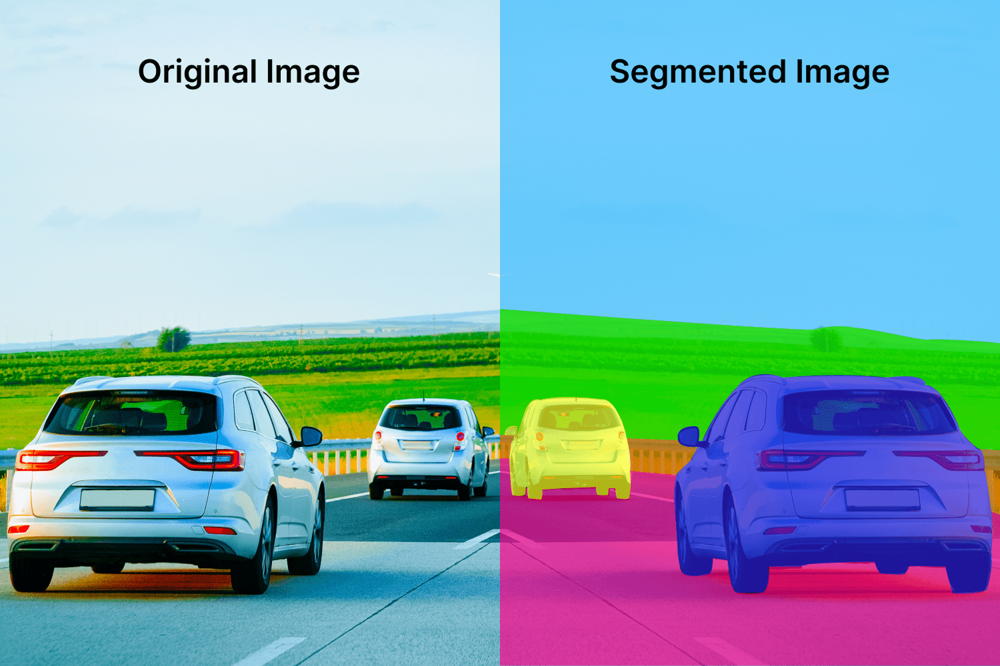

# Image Segmentation

Image segmentation is the process of matching images with similar features together. It's useful for object recognition, tracking, and image compression. Its goal is to partition an image into distinct regions containing pixels with similar attributes (clustering). 

**Image segmentation** uses the *discontinuity*, or *similarity* approach. Discontinuity is the idea of segmenting the image into regions based on discontinuity using gradients or edge detection. Similarity is the process of merging similar regions using techniques such as clustering, region growing, and more. 

## Otsu's Simple Segmentation

Simply put, **Otsu's simple segmentation** algorithm uses an image's gray levels to create segments. First, we create a histogram of our data where we plot gray levels against its number of occurrences. Then, we observe all of the peaks in the histogram, and then we define thresholds (cutoff halfway between) between each peak. This gives us grayscale image segments based on gray level "brightness". 
# Clustering

We are also able to segment images with color. We use clustering to achieve this, using k-means or mean-shift algorithms. 

## K-Means Clustering

When we perform k-means clustering on tricolor images, we think each point as a 3D vector of color. We follow the following steps:

1. **Initialization**: Choose k points as the initial centroids (cluster center). 
2. **Assignment**: Assign each point to the nearest centroid.
3. **Update**: Replace the previous centroid to be the mean of current points in the cluster. 
4. **Repeat**: Repeat steps 2 and 3 until convergence or maximum iterations reached. 

How do we choose a good value for k? We can use the elbow method to find the best value for k.

K-means is very sensitive to initialization. If we poorly initialize our points, it may lead to poor convergence speed and overall clustering. We have a few ways to initialize K-means:

1. Initialize randomly. (most common)
2. Select randomly using distributed points.
3. Run multiple times and select best results. 
4. K-means++.

## Mean-Shift

**Mean-shift** is used for unsupervised clustering. We don't need an initial K, and the algorithm works by shifting points towards local modes iteratively. The mode represents the highest density of data points in each region in the context of mean-shift. 

Mean-shift is related to [[05_machine_learning#Kernel Density Estimation / Parzen Window|kernel density estimation]] in the sense that we can imagine the data sampled from a probability distribution. We estimate the underlying distribution (or probability density function) for a set of data where we place our kernel on each point and add all the individual kernels to generate a probability surface. 

To implement, we start with $x$, which is a vector containing either color only (RGB) or spatial and color data (xyRGB). Then, for each $x$ pixel, we take the neighboring pixels and calculate the mean shift for $x$. Defining the neighboring pixels as $N(x)$, our mean shift is equal to:

$$
m(x)=\frac{\sum_{x_i\in N(x)}{K(x_i-x)x_i}}{\sum_{x_i\in N(x)}{K(x_i-x)}}
$$
Afterward, we update each $x$ to be the value of $m(x)$. We repeat this until our points stabilize. 
# Super Pixel Segmentation

**Superpixel segmentation** captures local and visual redundancy in images by grouping similar pixels together. It uses the **SLIC** superpixel algorithm, which is generated by clustering pixels based on color similarity and spatial proximity in the image. SLIC employs a five-dimensional vector comprised of CIELAB colorspace-format pixel colors as well as the position of the pixel. CIELAB color space contains an intensity value and two color values. Typically, SLIC is useful for image compression, object recognition, and tracking. 

The algorithm is as follows:
1. Choose $K$ to be the number of desired superpixels. 
2. Initialize cluster centers. 
3. Perturb? unsure
4. Assign best matching pixels from neighborhood around the cluster center based on a distance function. 
5. Compute new centers and residual error
6. Repeat 4-6 until residual error is lower than a threshold. 

The distance function is defined as $D_s =d_c+\frac{m}{s}d_{p}$ where $d_c$ is the Euclidian distance between colors, $d_p$ is the distance between spatial positions, $s$ is our grid interval, and $m$ is the compactness of our superpixel (larger is more compact). 

# Template Matching

Template matching is the process of taking a target image and finding the most similar image from iterating over every window of a sample image. This is very similar to covariance tracking. But how do we determine similarity?

Template matching typically takes a raw template of pixels and finds the most similar matches by minimizing one of the following:

- sum of absolute differences
- sum of squared differences
- normalized cross correlation

First, we can try **sum of absolute differences** by computing the absolute differences of pixel intensities between template $T$ and patch $P$. We compute the same for every patch $P$ within our search image. 

**Sum of squared differences** is the same approach, but we use *squared differences* instead of absolute. 

Both of these approaches have problems, though. They only work if both template and search image have the same brightness. 

Instead, we can use **normalized cross-correlation** to remove variations in illumination conditions. Normalized cross-correlation takes the dot product of two vectors and normalizing it: 

$$
NCC(P,T)=\sum_{r,g,b}\frac{1}{n-1}\sum_{x,y}\frac{(P(x,y)-\bar{P})(T(x,y)-\bar{T})}{\sigma_P\sigma_T}
$$

- $n$ is the number of pixels
- $\bar{P}$ is the mean of the patch
- $\bar{T}$ is the mean of the template
- $\sigma_P$ is the standard deviation of the patch
- $\sigma_T$ is the standard deviation of the template

Using this approach, we take the max NCC value as our closest match. When we need to handle scale, we can use this same method with image pyramids, where we construct a fixed size template of the smallest size we want to detect, scaling withsize. 